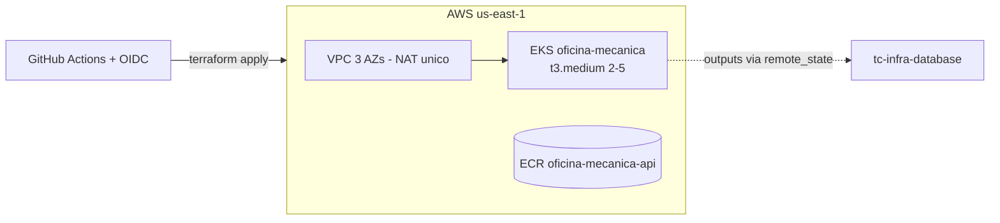

# tc-infra-kubernetes

Infraestrutura Kubernetes do Tech Challenge (Fase 3 — FIAP Pós Arquitetura de Software):
**VPC** (3 AZs, NAT único), **EKS** (node group t3.medium 2→5, IRSA, access entry para a
esteira do app), **ECR** (scan on push, tags imutáveis). Provisionado por **Terraform**
com state remoto em S3 (lock nativo `use_lockfile`).

> API Gateway (Etapa 4), AWS Load Balancer Controller e Grafana Alloy (Etapas 5–6) serão
> adicionados a este repositório.

## Arquitetura

## Esteira (CI/CD)

| Evento | Ação |
| --- | --- |
| Pull Request | `fmt` + `validate` + `plan` (resultado no summary do job) |
| Merge na `main` | `apply` automático |
| Botão Actions (workflow_dispatch) | `plan` \| `apply` \| `destroy` |

Autenticação via **OIDC** (role `gha-tc-infra-kubernetes`) — nenhum secret de AWS no repo.

## Subir / derrubar

- **Subir:** merge na `main`, ou Actions → Terraform → Run workflow → `apply` (~20 min).
- **Derrubar:** Actions → Terraform → Run workflow → `destroy` (~15 min).
  ⚠️ Derrubar **antes** o `tc-lambda-auth` e o `tc-infra-database` (dependem da VPC deste repo).
- **Local (fallback):** `terraform init && terraform apply` com credenciais AWS e Terraform ≥ 1.10.

## Ordem de deploy entre repositórios

`tc-infra-kubernetes` → `tc-infra-database` → `tc-lambda-auth` → app (`tech_challange_1`).
Destruição na ordem inversa.

## Repositórios relacionados

- [tech_challange_1](https://github.com/Os-Desacoplados-Pos-Tech-SOAP-FIAP/tech_challange_1) — aplicação NestJS
- [tc-infra-database](https://github.com/Os-Desacoplados-Pos-Tech-SOAP-FIAP/tc-infra-database) — RDS + Secrets Manager
- [tc-lambda-auth](https://github.com/Os-Desacoplados-Pos-Tech-SOAP-FIAP/tc-lambda-auth) — autenticação por CPF
